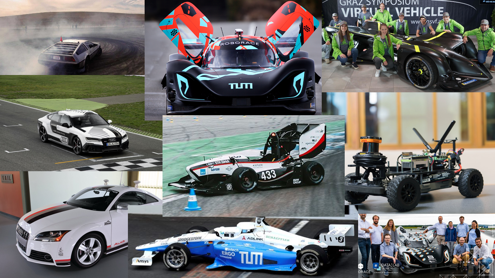

# Autonomous Racing Literature



This repository contains an .csv and a .bib (LaTeX Bibtex) file that includes all the literature, research papers and publications in the field of autonomous racing. Although the term of autonomous racing can be referred to different applications (e.g. drone racing) we are focusing in this literature overview only on research from the field of autonomous race cars. This list does not claim to be complete, we are happy to receive feedback from the community about missing papers. This list will be updated a few times a year to include new papers that were recently published.

**Last Update:** 08.08.2022

# Paper Reference
The collected research papers in this repository were used to create the paper ["Autonomous Vehicles on the Edge: A Survey on Autonomous Vehicle Racing"](https://ieeexplore.ieee.org/stamp/stamp.jsp?arnumber=9790832). If you find the information in this repository useful we would be happy if you cite it based on the following definition:

```
@article{Betz2022_RacingSurvey,
title     = "Autonomous vehicles on the edge: A survey on autonomous vehicle
             racing",
author    = "Betz, Johannes and Zheng, Hongrui and Liniger, Alexander and
             Rosolia, Ugo and Karle, Phillip and Behl, Madhur and Krovi,
             Venkat and Mangharam, Rahul",
journal   = "IEEE Open J. Intell. Transp. Syst.",
publisher = "Institute of Electrical and Electronics Engineers (IEEE)",
volume    =  3,
pages     = "458--488",
year      =  2022,
doi = "10.1109/ojits.2022.3181510"
}

```

# Literature Structure
The excel file currently includes 276 publications. We structured the .csv file mainly into 7 sections that cover both software and hardware developments:

0. Introduction and Overview
1. Perception
   1. Mapping
   2. Localization
   3. Object Detection
2. Planning
   1. Global Planning
   2. Local Planning
   3. Behavioral Planning
   4. Planning & Control
3. Control
   1. Classic Control Approaches
   2. Model Predictive Control
   3. Learning Based Control
   4. Drifting Control
   5. Optimization
4. End-To-End Approaches
   1. Optimization
   2. Deep Learning
   3. Reinforcement Learning
5. Applied Studies
   1. Evaluation
   2. Complete Software Stack
   3. Modelling
   4. Simulation
6. Autonomous Racing Hardware

# Literature .csv Document
This repository includes an .csv file called "AutonomousRacing_Literature.csv". This file contains all the papers that are related to autonomous vehicle racing. We provided additional columns that give interested readers the possibility to search for specific areas. You can filter and order this file with the following information:
* **Year:** Year the paper was published
* **First Author:** Last name and first name of first author
* **Section:** High-level section we created to structure the papers
* **Subsection:** Subsection in the according high level section to further categorize the papers
* **Topic:** General high-level topic what the paper is covering
* **Method:** Main method/algorithm type that is used in the paper
* **Paper Title:** Official title of the paper
* **Simulation Tested:** Was the algorithm(s) (code) developed in the paper tested and evaluated in a simulation environment: Yes/No
* **Hardware Tested:** Was the algorithm(s) (code) developed in the paper tested on a real autonomous racing vehicle hardware: Yes/No (Small Scale/Real Car)
* **Racing Series:** To which autonomous racing series belongs the paper: Real Car, Roborace, Indy Autonomous vehicle, 1:43, F1TENTH, DonkeyCar, DeepRacer, AutoRally, Formula Student
* **Link to Paper:** Official link to the website of the paper publisher
* **Link to Open Source Code:** Link to the open-source code/software (if available additionally) described in the paper

# Literature .bib Document
This repository includes a .bib (LaTeX Bibtex) file called "AutonomousRacing_Literature.bib". This file contains all the papers from the excel file with their corresponding bibtex information (Year, authors, journal type, proceedings, etc.).
Each bibtex entry is named after the "Author's Last Name" + "Year".

# Contribution
We are welcome interested researchers and developers in the field to contribute to this autonomous racing literature overview. People can integrate new papers in this last and/or even extend the list to more categories.

**Preliminary Remarks and Autonomous Racing Definition:** \
As stated in the paper, the term of autonomous racing can be referred to different applications (e.g. drone racing) but we are focusing in this list only on research in the field of autonomous racing **cars**. These racecars need to have four wheels, can either have a combustion engine or electrical engine as a main power unit, can be real racecars (e.g. Formula 1 car) or small-scale vehicles (e.g. 1:10 scale). In addition, the soft- and hardware that is displayed in this list must have a clear connection to the field of racing. This means that the authors of these papers either used a specific hardware that is acting in a racing environment (e.g. racetrack, adversarial setup), they are using a simulation environment that displays a racecar within an racing environment (e.g. racing game for PC) or their research displays a solution for a racing problem (e.g. driving fast around the racetrack). Although some authors present results and algorithms for high speed autonomous driving on the freeway this work is **not** covered in this survey because neither the aspect of handling the cars at the limit nor the adversarial context is given here sufficiently.

To contribute to this repository please create a pull request so we can review the changes you have made.
